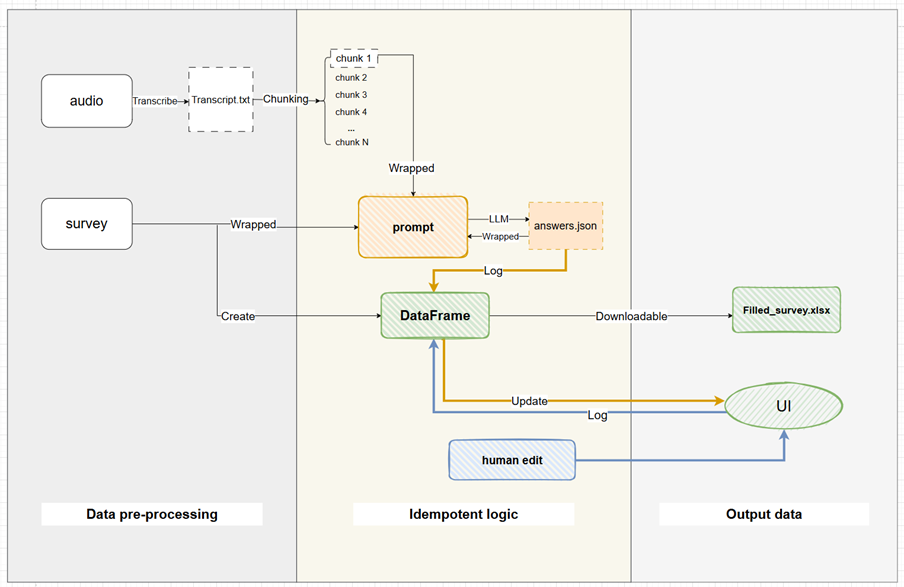

# AI-Assisted Survey Tool for Social Work Case Management

A minimum viable product (MVP) exploring the feasibility of AI-driven survey completion in social work settings. This prototype addresses critical challenges in survey administration by leveraging large language models to automatically extract structured responses from conversational audio recordings while preserving essential human oversight.

## Technical Implementation

### Core Features

#### Data Processing Pipeline
- **Transcription**: Automatic conversion of audio recordings to text using OpenAI Whisper
- **Chunking Strategy**: Configurable text segmentation (default: 12 sentences per chunk, 2-sentence overlap)
- **Structured Extraction**: AI-powered survey responses using GPT-4o-mini
- **Quality Assurance**: Confidence scoring and human review mechanisms

#### User Interface
- **Streamlit-based Frontend**: Web application interface for survey and audio file uploads
- **Progress Visualization**: Real-time completion status bar
- **Response Management**: Color-coded confidence levels and manual editing capabilities
- **Export Functionality**: Downloadable survey results in structured Excel format

#### Evaluation Framework
- **Performance Metrics**: Accuracy assessment using true/false positive and negative classifications
- **Latency Analysis**: Round-trip time measurement with trimmed mean calculations
- **Cost Analysis**: Token usage tracking for computational efficiency evaluation

## Installation

### Prerequisites
- Python 3.8 or higher
- OpenAI API access (Whisper and GPT-4o-mini models)

### Setup
```bash
# Clone repository
git clone https://github.com/AmyFeng0227/AI-assisted-survey-tool.git
cd AI-assisted-survey-tool

# Create virtual environment
python -m venv .venv
source .venv/bin/activate  # Windows: .venv\Scripts\activate

# Install dependencies
pip install -r requirements.txt

# Configure environment variables
echo "OPENAI_API_KEY_survey=your_api_key_here" > .env
```

## Usage

### Web Interface
```bash
streamlit run main.py
```
Access at `http://localhost:8501`

### Workflow
1. **Upload Survey Template**: Excel file with question definitions, types, and response options
2. **Upload Audio Recording**: Interview recordings (MP3, M4A, WAV)
3. **Automated Processing**: Transcript processed chunk by chunk, and update interface, with AI confidence flagging
4. **Human Oversight**: Manual editing allow and overwrites AI answers
5. **Export Results**: Download completed survey as Excel file

The following diagram illustrates the complete processing pipeline:



### Evaluation Scripts
```bash
# Single evaluation run
python run_evaluation.py

# Batch evaluation across configurations
python run_batch_evaluation.py

# Results analysis
python evaluation/summarize_evaluation_results.py
```

## Configuration

Primary settings in `app/config.py`:
```python
n_sentences = 12  # Sentences per chunk
n_overlap = 2     # Overlapping sentences between chunks
model = "o4-mini-2025-04-16"  # Language model specification
```

## Project Structure

```
surveytool/
├── app/                          # Core processing modules
│   ├── audio.py                  # Speech-to-text transcription
│   ├── config.py                 # System configuration and API clients
│   ├── evaluation.py             # Performance metrics calculation
│   ├── main_workflow.py          # Primary processing pipeline
│   ├── prompt.py                 # Language model prompt engineering
│   ├── survey.py                 # Survey data structure management
│   └── answer.py                 # Response extraction and validation
├── evaluation/                   # Assessment framework
│   ├── summarize_evaluation_results.py  # Results analysis
│   ├── run_evaluation.py        # Single evaluation script
│   ├── run_evaluation.bat       # Windows batch script for evaluation
│   └── run_batch_evaluation.py  # Batch evaluation script
├── ui/                          # User interface
│   ├── survey_app.py            # Streamlit application
│   └── styles.css               # Interface styling
├── .streamlit/                  # Streamlit configuration
│   └── config.toml             # Development settings
├── main.py                      # Application entry point
└── requirements.txt             # Python dependencies
```

**Note**: The `data/` directory and evaluation result files are created automatically when the application runs. These are gitignored to protect sensitive data.

## Key Components

### Audio Processing (`app/audio.py`)
- OpenAI Whisper integration for speech-to-text conversion
- Configurable text chunking with sentence-based segmentation

### Survey Management (`app/survey.py`)
- Excel template processing
- Creating survey string as preparation for prompts
- DataFrame creation

### Prompt Engineering (`app/prompt.py`)
- Compiling AI prompts

### Answer Extraction (`app/answer.py`)
- Calling LLM for response
- JSON parsing and validation with retry logic
- Answer updating and DataFrame management

### Main Workflow (`app/main_workflow.py`)
- Orchestrates the complete processing pipeline

### System Configuration (`app/config.py`)
- OpenAI client initialization and API settings
- Chunking parameters (sentences per chunk, overlap)

### Evaluation System (`app/evaluation.py`)
- Accuracy metrics (TP, TN, FP, FN)
- Performance tracking (RTT, token usage, retry counts)

## Evaluation Results

Best performing configurations from testing:

| Configuration | Accuracy | Trimmed Mean RTT | Token Usage | Total Chunks |
|---------------|----------|------------------|-------------|--------------|
| 4 sentences, 2 overlap | 80.3% | 7.03s | 137,336 tokens | 67 |
| 12 sentences, 2 overlap | 78.7% | 11.57s | 33,543 tokens | 14 |
| 20 sentences, 2 overlap | 77.3% | 24.10s | 18,824 tokens | 8 |

**Key Findings:**
- 2-sentence overlap consistently yields slightly higher accuracy
- Smaller chunks provide better user experience but higher token costs
- Strong correlation (r=0.97) between latency and token usage


- **Visual Indicators**: Color-coded confidence levels for rapid assessment

## License

This project is developed for research purposes. Implementation in production environments requires consideration of data privacy regulations and ethical frameworks.

## Acknowledgments

Developed with input from SOS Children's Villages for social work case management context. Uses OpenAI's language model technologies and Streamlit framework. 